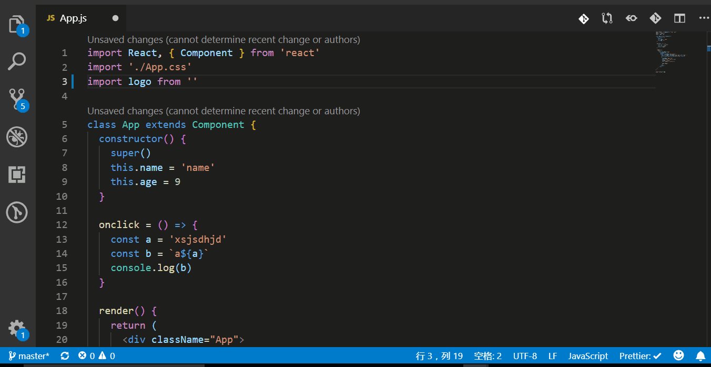
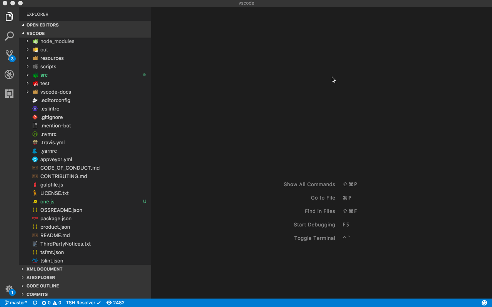
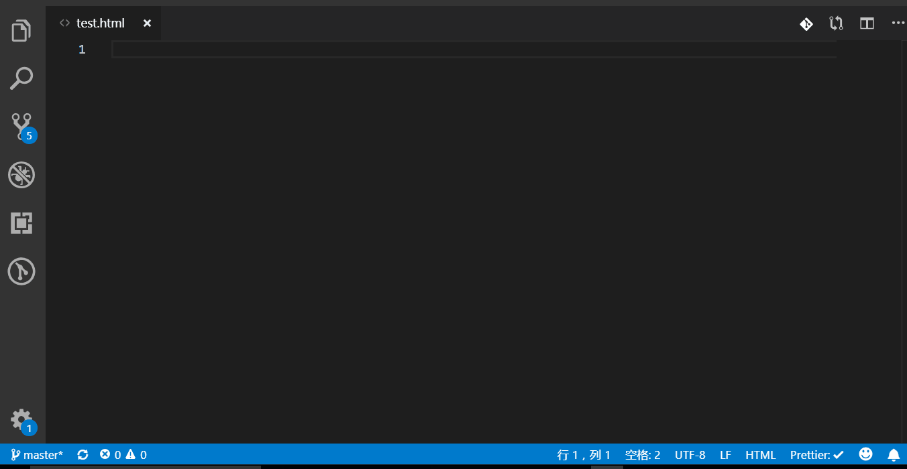

# VsCode Editor 配置

## VsCode 插件推荐

### 编码格式

| 插件                                                  | 简述                              | 官网链接                                                                                       | 是否必需 |
| ----------------------------------------------------- | --------------------------------- | ---------------------------------------------------------------------------------------------- | -------- |
| [Auto Close Tag](#Auto-Close-Tag)                     | 自动闭合标签                      | [详情](https://marketplace.visualstudio.com/items?itemName=formulahendry.auto-close-tag)       | 推荐     |
| [Auto Rename Tag](#Auto-Rename-Tag)                   | 自动重命名标签                    | [详情](https://marketplace.visualstudio.com/items?itemName=formulahendry.auto-rename-tag)      | 推荐     |
| [Bracket Pair Colorizer](#Bracket-Pair-Colorizer)     | 生成易读的彩色括号                | [详情](https://marketplace.visualstudio.com/items?itemName=CoenraadS.bracket-pair-colorizer)   | 推荐     |
| [Path Intellisense](#Path-Intellisense)               | 路径补全                          | [详情](https://marketplace.visualstudio.com/items?itemName=christian-kohler.path-intellisense) | 推荐     |
| [ESLint](#ESLint)                                     | 用于支持 JavaScript 实时语法校验  | [详情](https://marketplace.visualstudio.com/items?itemName=dbaeumer.vscode-eslint)             | 必需     |
| [Prettier - Code formatter](#Prettier-Code-formatter) | 格式化为标准风格                  | [详情](https://marketplace.visualstudio.com/items?itemName=esbenp.prettier-vscode)             | 必需     |
| [EditorConfig for VS Code](#EditorConfig-for-VS-Code) | EditorConfig 规范不同编辑器的配置 | [详情](https://marketplace.visualstudio.com/items?itemName=EditorConfig.EditorConfig)          | 推荐     |
| [stylelint](#stylelint)                               | 样式检查                          | [详情](https://marketplace.visualstudio.com/items?itemName=shinnn.stylelint)                   | 必需     |

### Git

| 插件                                                  | 简述                            | 官网链接                                                                            | 是否必需 |
| ----------------------------------------------------- | ------------------------------- | ----------------------------------------------------------------------------------- | -------- |
| [Git History](#Git-History)                           | 可查看文件的 git log 并进行对比 | [详情](https://marketplace.visualstudio.com/items?itemName=donjayamanne.githistory) | 推荐     |
| [GitLens-Git supercharged](#GitLens-Git-supercharged) | 显示代码每一行的最新修改人      | [详情](https://marketplace.visualstudio.com/items?itemName=eamodio.gitlens)         | 推荐     |

### 语法提示

| 插件                                                                                                 | 简述                                          | 官网链接                                                                                    | 是否必需 |
| ---------------------------------------------------------------------------------------------------- | --------------------------------------------- | ------------------------------------------------------------------------------------------- | -------- |
| [HTML Snippets](#HTML-Snippets-Demo)                                                                 | HTML 相关语法提示                             | [详情](https://marketplace.visualstudio.com/items?itemName=abusaidm.html-snippets)          | 推荐     |
| [JavaScript (ES6) code snippets](#JavaScript-ES6-code-snippets-Demo)                                 | JavaScript 相关语法提示                       | [详情](https://marketplace.visualstudio.com/items?itemName=xabikos.JavaScriptSnippets)      | 推荐     |
| [ES7 React/Redux/GraphQL/React-Native snippets](#ES7-React-Redux-GraphQL-React-Native-snippets-Demo) | ES7 React/Redux/GraphQL/React-Native 语法提示 | [详情](https://marketplace.visualstudio.com/items?itemName=dsznajder.es7-react-js-snippets) | 推荐     |

#### Auto-Close-Tag

自动闭合 HTML 标签


#### Auto-Rename-Tag

Auto-Rename-Tag 插件可在修改 HTML 标签时,自动修改匹配的标签


#### Bracket-Pair-Colorizer

生成易读的彩色括号


#### Path-Intellisense

Path-Intellisense 插件可在编辑器中输入路径时,自动补全。


#### ESLint

Eslint 一个插件化的 javascript 代码检测工具,相关配置见编码规范


#### Prettier-Code-formatter

Prettier-Code-formatter 是代码风格统一的插件,通过简单的配置,让编辑器自动帮我们修改代码格式,相关配置见编码规范


#### EditorConfig-for-VS-Code

不同编辑器编辑的文本格式会有些区别,若不统一某些规范,与别人合作时,每次更新代码就会出现一堆报错。大部分编辑器都有 EditorConfig-for-VS-Code 这个插件,即使团队成员使用不同的 IDE,也可以很好的统一代码风格。使用方法是在项目根目录下添加.editorconfig 文件,在.editorconfig 文件中添加以下代码

```json
[*]
# Indentation style
# Possible values - tab, space
indent_style = space

# Indentation size in single-spaced characters
# Possible values - an integer, tab
indent_size = 2

# Line ending file format
# Possible values - lf, crlf, cr
end_of_line = lf

# File character encoding
# Possible values - latin1, utf-8, utf-16be, utf-16le
charset = utf-8

# Denotes whether to trim whitespace at the end of lines
# Possible values - true, false
trim_trailing_whitespace = true

# Denotes whether file should end with a newline
# Possible values - true, false
insert_final_newline = true
```


#### stylelint

stylelint 是一个强大和现代的 CSS 审查工具,可以解析 SCSS 语法,有助于开发者推行统一的代码规范,避免样式错误。相关配置见编码规范。


#### Git-History

查看提交历史,并可比较当前文件与各提交版本的异同。



#### GitLens-Git-supercharged

定位当前代码最新修改人,并显示当前行修改详细信息,还可查看全部日志信息。


#### HTML-Snippets

HTML 语法提示,简写命令,生成基础代码片段。


#### JavaScript-ES6-code-snippets

JS 语法提示,简写命令,生成基础代码片段。


#### ES7-React-Redux-GraphQL-React-Native-snippets

ES7,React 等语法提示,简写命令,生成基础代码片段。


## VsCode 配置文件

在项目文件根目录下新建.vscode 文件夹,在此文件夹下新建 settings.json 文件
settings.json 配置文件

```json
{
  // 设置行尾序列为LF(必需)
  "files.eol": "\n",
  // 是否开启eslint检测(必需)
  "eslint.enable": true,
  // 编辑器字体大小
  "editor.fontSize": 14,
  // 空格
  "editor.tabSize": 2,
  // 保存时是否自动化格式文档
  "editor.formatOnSave": true,
  // 调整窗口的缩放级别
  "window.zoomLevel": 2,
  // 文件保存时,是否自动根据eslint进行格式化
  "eslint.autoFixOnSave": true,
  // VsCode 文件搜索区域配置
  "search.exclude": {
    "**/dist": true,
    "**/build": true,
    "**/package-lock.json": true,
    "**/.gitignore": true,
    "**/.vscode": false,
    "**/yarn.lock": true,
    "**/package.json": true
  }
}
```

<br>更多配置项 [https://code.visualstudio.com/docs/getstarted/settings](https://code.visualstudio.com/docs/getstarted/settings)<br>

## VsCode 常用快捷键

### 主命令框

| 功能         | win 快捷键         | mac 快捷键   |
| ------------ | ------------------ | ------------ |
| 打开命令面板 | F1 或 ctrl+shift+P | cmd+option+P |

### 编辑器以及窗口管理

| 功能           | win 快捷键   | mac 快捷键   |
| -------------- | ------------ | ------------ |
| 打开一个新窗口 | ctrl+shift+N | cmd+option+N |
| 关闭窗口       | ctrl+shift+W | cmd+option+W |
| 新建文件       | ctrl+N       | cmd+N        |
| 文件之间切换   | ctrl+Tab     | cmd+Tab      |

### 代码格式调整

| 功能       | win 快捷键  | mac 快捷键     |
| ---------- | ----------- | -------------- |
| 代码格式化 | shift+alt+F | shift+option+F |
| 撤销操作   | ctrl+Z      | cmd+Z          |
| 保存操作   | ctrl+S      | cmd+S          |

### 代码块区域

| 功能                 | win 快捷键           | mac 快捷键        |
| -------------------- | -------------------- | ----------------- |
| 一单词为单位移动     | ctrl+left/right      | cmd+left/right    |
| 回到行首或行尾       | home/end             | -                 |
| 上下行交换位置       | shift+top/bottom     | option+top/bottom |
| 删除当前行代码       | shift+delete         | option+delete     |
| 删除光标右侧一个单词 | ctrl+delete          | cmd+delete        |
| 剪切当前行代码       | ctrl+X               | cmd+X             |
| 向上向下复制一行     | shift+alt+top/bottom | -                 |
| 注释掉当前行         | ctrl+/               | cmd+/             |

### 查找替换

| 功能             | win 快捷键   | mac 快捷键  |
| ---------------- | ------------ | ----------- |
| 查找             | ctrl+F       | cmd+F       |
| 查找替换         | ctrl+H       | cmd+H       |
| 整个文件夹中查找 | ctrl+shift+F | cmd+shift+F |

<br>想了解更多快捷键,可在 VsCode 编辑器内选择 文件>首选项>键盘快捷方式<br>

VsCode 相关配置查询 [https://code.visualstudio.com/docs](https://code.visualstudio.com/docs)
