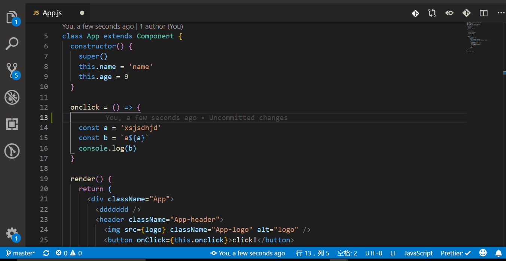

# Vs Code 插件推荐

## 编码格式

| 插件                                                  | 简述                              | 官网链接                                                                                       | 推荐指数 |
| ----------------------------------------------------- | --------------------------------- | ---------------------------------------------------------------------------------------------- | -------- |
| [Auto Close Tag](#Auto-Close-Tag)                     | 自动闭合标签                      | [详情](https://marketplace.visualstudio.com/items?itemName=formulahendry.auto-close-tag)       |
| [Auto Rename Tag](#Auto-Rename-Tag)                   | 自动重命名标签                    | [详情](https://marketplace.visualstudio.com/items?itemName=formulahendry.auto-rename-tag)      |
| [Bracket Pair Colorizer](#Bracket-Pair-Colorizer)     | 生成易读的彩色括号                | [详情](https://marketplace.visualstudio.com/items?itemName=CoenraadS.bracket-pair-colorizer)   |
| [Path Intellisense](#Path-Intellisense)               | 路径补全                          | [详情](https://marketplace.visualstudio.com/items?itemName=christian-kohler.path-intellisense) |
| [ESLint](#ESLint)                                     | 用于支持 JavaScript 实时语法校验  | [详情](https://marketplace.visualstudio.com/items?itemName=dbaeumer.vscode-eslint)             |
| [Prettier - Code formatter](#Prettier-Code-formatter) | 格式化为标准风格                  | [详情](https://marketplace.visualstudio.com/items?itemName=esbenp.prettier-vscode)             |
| [EditorConfig for VS Code](#EditorConfig-for-VS-Code) | EditorConfig 规范不同编辑器的配置 | [详情](https://marketplace.visualstudio.com/items?itemName=EditorConfig.EditorConfig)          |
| [stylelint](#stylelint)                               | 样式检查                          | [详情](https://marketplace.visualstudio.com/items?itemName=shinnn.stylelint)                   |

## Git

| 插件                                                  | 简述                            | 官网链接                                                                            |
| ----------------------------------------------------- | ------------------------------- | ----------------------------------------------------------------------------------- |
| [Git History](#Git-History)                           | 可查看文件的 git log 并进行对比 | [详情](https://marketplace.visualstudio.com/items?itemName=donjayamanne.githistory) |
| [GitLens-Git supercharged](#GitLens-Git-supercharged) | 显示代码每一行的最新修改人      | [详情](https://marketplace.visualstudio.com/items?itemName=eamodio.gitlens)         |

## 语法提示

| 插件                                                                                                 | 简述                                          | 官网链接                                                                                    |
| ---------------------------------------------------------------------------------------------------- | --------------------------------------------- | ------------------------------------------------------------------------------------------- |
| [HTML Snippets](#HTML-Snippets-Demo)                                                                 | HTML 相关语法提示                             | [详情](https://marketplace.visualstudio.com/items?itemName=abusaidm.html-snippets)          |
| [JavaScript (ES6) code snippets](#JavaScript-ES6-code-snippets-Demo)                                 | JavaScript 相关语法提示                       | [详情](https://marketplace.visualstudio.com/items?itemName=xabikos.JavaScriptSnippets)      |
| [ES7 React/Redux/GraphQL/React-Native snippets](#ES7-React-Redux-GraphQL-React-Native-snippets-Demo) | ES7 React/Redux/GraphQL/React-Native 语法提示 | [详情](https://marketplace.visualstudio.com/items?itemName=dsznajder.es7-react-js-snippets) |

### Auto-Close-Tag

自动闭合 HTML 标签


### Auto-Rename-Tag

修改 HTML 标签时，自动修改匹配的标签


### Bracket-Pair-Colorizer

生成易读的彩色括号


### Path-Intellisense

编辑器中输入路径时,自动补全


### ESLint

Eslint 一个插件化的 javascript 代码检测工具，相关配置见编码规范


### Prettier-Code-formatter

代码风格统一的插件,通过简单的配置,让编辑器自动帮我们修改代码格式，相关配置见编码规范


### EditorConfig-for-VS-Code

不同编辑器对文本的格式会有一定的区别，如果不统一某些规范，可能你跟别人合作的时候，每次更新代码就会出现一堆报错。大部分编辑器都有这个插件，即使团队成员使用不同的 IDE，也可以很好的统一代码风格。使用方法是在项目根目录下添加.editorconfig 文件，在.editorconfig 文件中添加以下代码

```json
[*]
# Indentation style
# Possible values - tab, space
indent_style = space

# Indentation size in single-spaced characters
# Possible values - an integer, tab
indent_size = 2

# Line ending file format
# Possible values - lf, crlf, cr
end_of_line = lf

# File character encoding
# Possible values - latin1, utf-8, utf-16be, utf-16le
charset = utf-8

# Denotes whether to trim whitespace at the end of lines
# Possible values - true, false
trim_trailing_whitespace = true

# Denotes whether file should end with a newline
# Possible values - true, false
insert_final_newline = true
```


### stylelint

stylelint 具体配置可见编码规范


### Git-History


### GitLens-Git-supercharged


### HTML-Snippets


### JavaScript-ES6-code-snippets



### ES7-React-Redux-GraphQL-React-Native-snippets


# vscode 配置文件

```
cd 项目文件
mkdir .vscode
cd .vscode
type NUL>settings.json(新建 setting.json 文件)
```

settings.json 的必需配置

```json
{
  // 设置行尾序列为LF
  "files.eol": "\n",
  // 是否开启eslint检测
  "eslint.enable": false
}
```

settings.json 的推荐配置

```json
{
  // 设置行尾序列为LF
  "files.eol": "\n",
  // 编辑器字体大小
  "editor.fontSize": 14,
  // 空格
  "editor.tabSize": 2,
  // 保存时是否自动化格式文档
  "editor.formatOnSave": true,
  // 调整窗口的缩放级别
  "window.zoomLevel": 2,
  // 文件保存时，是否自动根据eslint进行格式化
  "eslint.autoFixOnSave": true,
  // 是否开启eslint检测
  "eslint.enable": false,
  // VScode 文件搜索区域配置
  "search.exclude": {
    "**/dist": true,
    "**/build": true,
    "**/package-lock.json": true,
    "**/.gitignore": true,
    "**/.vscode": false,
    "**/yarn.lock": true,
    "**/package.json": true
  }
}
```

<br>更多配置项 [https://code.visualstudio.com/docs/getstarted/settings](https://code.visualstudio.com/docs/getstarted/settings)<br>

# vscode 常用快捷键

## 主命令框

| 功能         | win 快捷键         | mac 快捷键 |
| ------------ | ------------------ | ---------- |
| 打开命令面板 | F1 或 Ctrl+Shift+P | -          |

## 编辑器以及窗口管理

| 功能           | win 快捷键   | mac 快捷键  |
| -------------- | ------------ | ----------- |
| 打开一个新窗口 | Ctrl+Shift+N | Cmd+Shift+N |
| 关闭窗口       | Ctrl+Shift+W | Cmd+Shift+W |
| 新建文件       | Ctrl+N       | Cmd+N       |
| 文件之间切换   | Ctrl+Tab     | Cmd+Tab     |

## 代码格式调整

| 功能       | win 快捷键  | mac 快捷键     |
| ---------- | ----------- | -------------- |
| 代码格式化 | Shift+Alt+F | shift+Option+F |
| 撤销操作   | Ctrl+Z      | Cmd+Z          |
| 保存操作   | Ctrl+S      | Cmd+S          |

## 查找替换

| 功能             | win 快捷键   | mac 快捷键  |
| ---------------- | ------------ | ----------- |
| 查找             | Ctrl+F       | Cmd+F       |
| 查找替换         | Ctrl+H       | Cmd+H       |
| 整个文件夹中查找 | Ctrl+Shift+F | Cmd+Shift+F |

## 显示相关

| 功能 | win 快捷键 | mac 快捷键 |
| ---- | ---------- | ---------- |
| 全屏 | F11        | -          |

<br>更多快捷键 文件>首选项>键盘快捷方式<br>

vscode 相关配置查询 [https://code.visualstudio.com/docs](https://code.visualstudio.com/docs)
